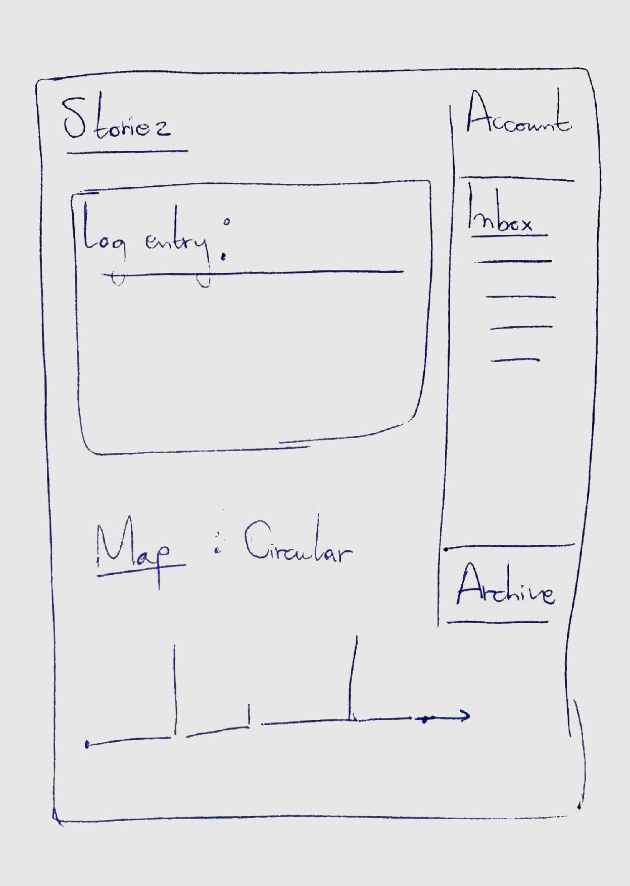
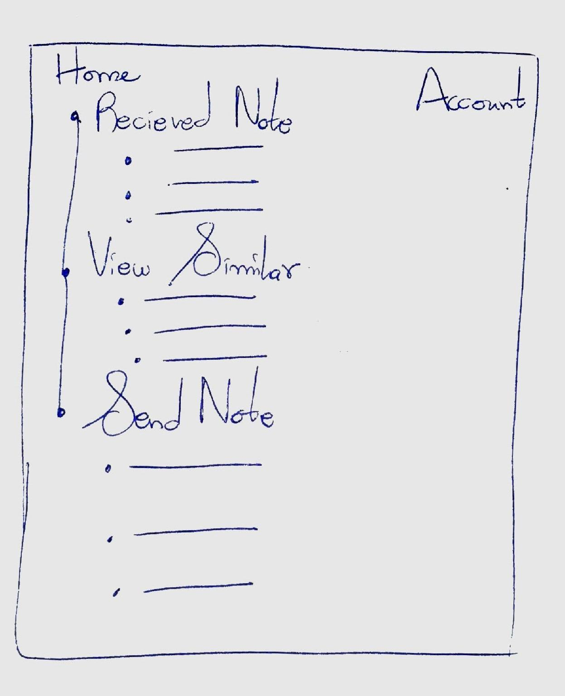
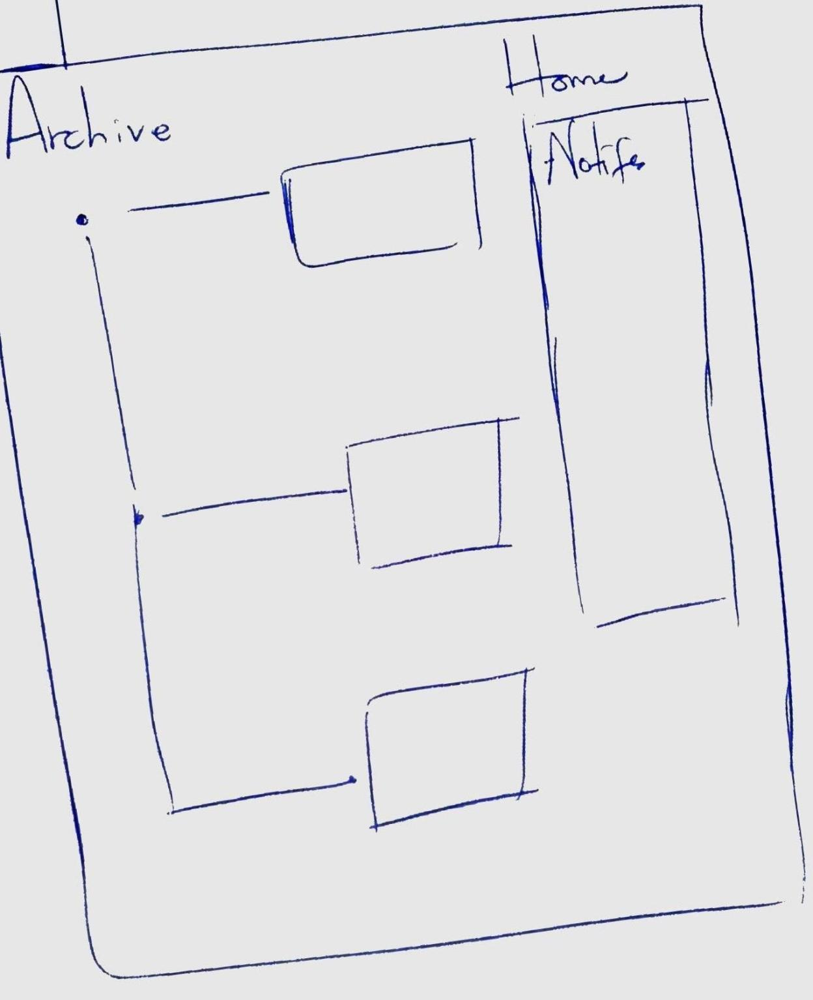

# Storiez
### A social network of telling, connecting and sharing stories and experiences
## Overview

(___TODO__: a brief one or two paragraph, high-level description of your project_)

The way we tell stories is linear. And reading a book is done linearly. A photo is a scene frozen in time. However, time is as much circular as it is linear, with loops of events occurring that have occured before. A story in a book doesn't tell the other story that happens at the same time, in another book. A photo taken of something doesn't capture something else. The experiences we have - of joy, of peace, of war, of sadness, are emotions that many people can experience at the same time - And these experiences have different layers - from opinions that inform how we react to certain events, to the sensibilities that we have as people to be a certain version of ourselves at a certain point in time, to the perspectives that we have. 
_Storiez_ is a website that draws lets it's users find out if their stories are connected, if their experiences are related to other people's experience. It will allow uses to log in entries, create a timeline and circle for their lives and draw connections between the user's experiences and the experiences of other people.
Remembering what to buy at the grocery store is waaaaay too difficult. Also, shopping for groceries when you're hungry leads to regrettable purchases. Sooo... that's where Shoppy Shoperson comes in!


## Data Model


The application will store Users, log entries

* Each entry will consist of one or more of: log entries, photos
* A user will be able to be told if other people are going through a similar experience, i.e. if what they are going through is something a character in a book has gone through, for example, if a user called Issa is doing her final exams and is anxious, the application will will relay other people's experiences to the user.
* The application will fill in the user's timeline with each experience and and display the experience in a timeline and circle of their life in totality


An Example User:

```javascript
{
  username: "Issa",
  hash: // a password hash,
  experiences: [
    {Date: 2019-05-27, emotions: ["joy", "peace"], log:" Finally getting done with Finals so it's time for Summer to really begin"},
    {Date: 2020-04-01, emotions: ["lazy", "bored", "sleepy"], log:" Corona be turning the world upside down"}

    ]
}
```


## [Link to Commented First Draft Schema](db.js) 


## Wireframes

/list/create - page for creating a new shopping list



/list - page for showing all shopping lists



/list/slug - page for showing specific shopping list



## Site map

Home
|
  Notifications
  |
  Archive
  |
  Account

Here's a [complex example from wikipedia](https://upload.wikimedia.org/wikipedia/commons/2/20/Sitemap_google.jpg), but you can create one without the screenshots, drop shadows, etc. ... just names of pages and where they flow to.

## User Stories or Use Cases


1. as non-registered user, I can register a new account with the site
2. as a user, I can log in to the site
3. as a user, I can add a personal experience list
4. as a user, I can view all of my experiences as a linear or circular
5. as a user, I can send messages to other users with a similar experience 
6. as a user, I can recieve messages from other users

## Research Topics

* (5 points) Integrate user authentication
    * I'm going to be using passport for user authentication
    * And account has been made for testing; I'll email you the password
    * see <code>cs.nyu.edu/~jversoza/ait-final/register</code> for register page
    * see <code>cs.nyu.edu/~jversoza/ait-final/login</code> for login page
* (4 points) Perform client side form validation using a JavaScript library
    * see <code>cs.nyu.edu/~jversoza/ait-final/my-form</code>
    * if you put in a number that's greater than 5, an error message will appear in the dom
* (5 points) PWAs
    * Progressive Web Applications are the future of the web (looks like it). It's a new field and a lot to cover and learn. Giving it 5 points


## [Link to Initial Main Project File](src/app.js) 

(___TODO__: create a skeleton Express application with a package.json, app.js, views folder, etc. ... and link to your initial app.js_)

