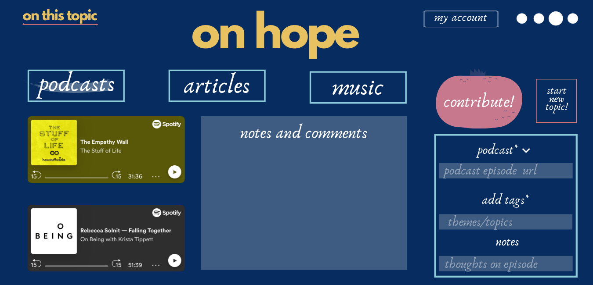
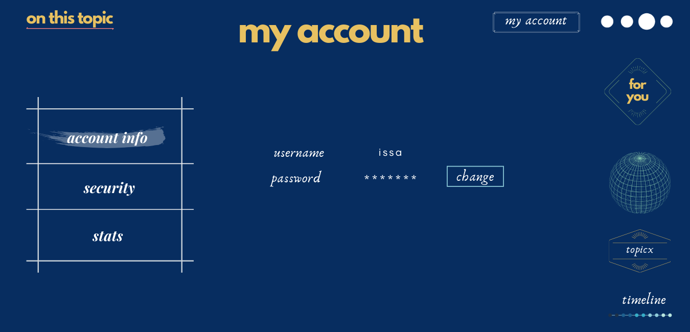
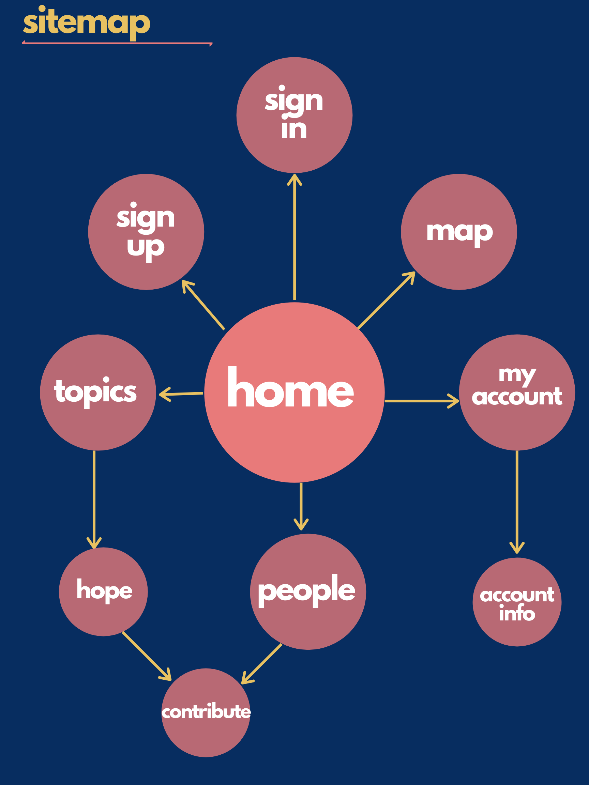

# On This Topic
### A platform for curated podcasts, articles and music on a topic
## Overview

Listen and read to curated playlists of podcasts, music and articles on a certain topics. 

### Description
Ever interested in listening to different opinions on a certain topic for example Hope, Love, or a moment in history? There are podcasts just for these topics, but what if you could have different takes on the topic from different podcasts. For instance, if you could listen to different opinions about the city of Nairobi and have a publicly curated list of podcasts, music and articles that speak to a certain topic, that feature a particular public figure or that talk about a certain place. This is where _On This Topic_ comes in. Find curated lists of podcasts, music and articles that speak to a certain topic, place, or featuring a particular public figure.


## Data Model

The Web application will have users suggest topics, and for each topic, add links to podcast episodes, articles and curated playlists. Each podcast episode will be ranked based on likes/recommendations. 
* A user will be able to add/submit a topic to the site
* For each topic, a user will be able to add a link to an article, a podcast episode or a song (they will be referred to as resources)
* For each resource, a user will have to tag the location (where the resource was produced), tags for the resource, notes to the particular resourse
* Users will be able to add notes to a resource
* Each resource (article, podcast episode or song) will be ranked based on number of likes/recommendations
* Each contribution (a resource or note) for a particular user will be tied to that user and the user will only be able to recommend a resource once. 
* Each resource will have a resourceID (rid), linked to the particular topic

An Example User:

```javascript
{
  username: "Issa",
  hash: // a password hash,
  contributions: { "FaithX01"}
  
}
```


## [Link to Commented First Draft Schema](db.js) 


## Wireframes

/home - home page 


/signup - sign up page


/signin - sign in page (for users with accounts)


/home - home page (When a user is signed in - has access to _my account_)


/topics/hope - page for showing the topic on hope


/topics/hope/contribute - page for showing the topic on hope with access to contribute form



/topics/onfear - Page for showing the topic of fear


/topics/hope - page for showing the topic on hope


/map - page for showing a world map of topics and people


/foryou/hope - page for a particular users contributions


/myaccount - Page to access a users account info




## Site map



## User Stories or Use Cases

As a non-registered user, I can:
1. register a new account with the site
2. View and read content on the site

As a registered user. I can: 

3. log in to the site
4. add a particular topic
5. add a resource to a particular topic
6. upvote/recomment/like a particular resource
7. add a note/comment to a partucular resource
8. view and change account details

## Research Topics

* (5 points) Integrate user authentication
    * I'm going to be using passport for user authentication
    * And account has been made for testing; I'll email you the password
    * see <code>cs.nyu.edu/~jversoza/ait-final/register</code> for register page
    * see <code>cs.nyu.edu/~jversoza/ait-final/login</code> for login page
* (4 points) Perform client side form validation using a JavaScript library
    * see <code>cs.nyu.edu/~jversoza/ait-final/my-form</code>
    * if you put in a number that's greater than 5, an error message will appear in the dom
* (5 points) PWAs, APIs
    * Progressive Web Applications are the future of the web (looks like it). It's a new field and a lot to cover and learn. Giving it 5 points
    * I plan to use some apis to add to the site in order to display the links to the podcasts, songs or articles. I also plan on using Google Maps APIs


## [Link to Initial Main Project File](src/app.js) 

